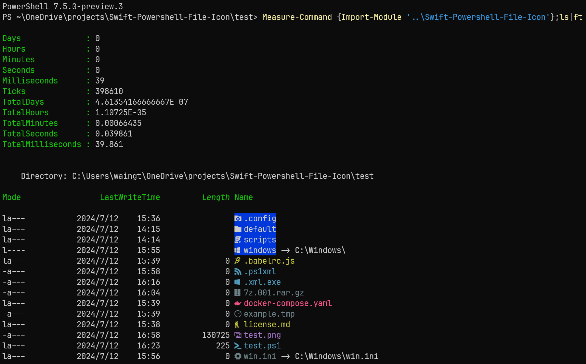

# Swift-Powershell-File-Icon

## Overview

A PowerShell module for adding colorful icons when displaying file and folder names, while avoiding long loading times!

The display icons depends on modified fonts at [Nerd Fonts](https://github.com/ryanoasis/nerd-fonts).

The display color depends on the terminal's support for ANSI escape sequences

Screenshot:



## Installation

1. Download a nerd font

   - download from https://www.nerdfonts.com/font-downloads
   - or use Scoop

   ```powershell
   scoop bucket add nerd-fonts
   sudo scoop install nerd-fonts/Cascadia-Code -g
   ```
2. Change terminal font family to nerd font
3. Install this module

   - use PowerShellGet:

   ```powershell
   Install-Module Swift-Powershell-File-Icon -SkipPublisherCheck
   ```

   - or use Scoop
   ```powershell
   # TODO
   ```

4. Add startup code in powershell profile

   - for example

   ```powershell
   Add-Content $PROFILE "Import-Module Swift-Powershell-File-Icon"
   ```

## Details

It overwrites `NameString` property definition of `System.IO.DirectoryInfo` and `System.IO.FileInfo`. For powershell version that is lower than 7.2, use a custom `Format.ps1xml` file to change the display instead.

For file icons the fullname is tried to match first, then the double extension, and finally the extension.

Files or folders that are not matched are shown with default icon.

Our goal is to reduce loading time to less than 100 milliseconds, for which themes need to be pre-generated in JSON format.

## Sources

### [Seti theme](https://github.com/jesseweed/seti-ui)

- seti-mapping.psd1 is modified from https://github.com/jesseweed/seti-ui/blob/master/styles/components/icons/mapping.less

- seti-ui.psd1 is modified from https://github.com/jesseweed/seti-ui/blob/master/styles/ui-variables.less
